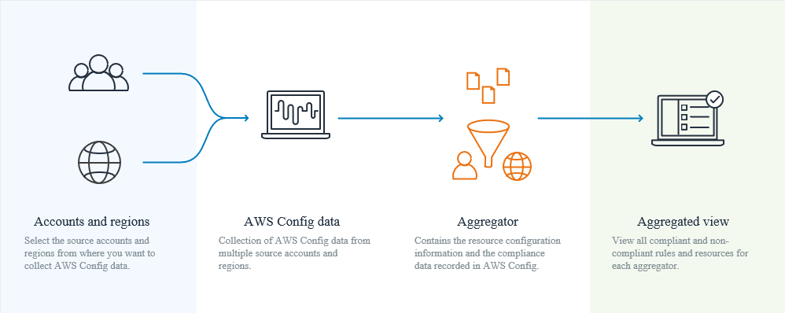

# aws_devops_notes

notes of preparing devops exam

## High Availability, Fault Tolerance, and Disaster Recovery

## RDS

Multi-AZ standby instance is different to multi region read replica. Standby can only be hosted in the same region and can support auto failover. Multi region read replica can be used as multi region disaster recovery plan and has to be enabled manually when disaster happens.

Refs: [Implementing a DR strategy with Amazon RDS](https://aws.amazon.com/blogs/database/implementing-a-disaster-recovery-strategy-with-amazon-rds/)

## Incident and Event Response

## Monitoring and Logging

## SDLC Automation

### [AWS CloudFormation UpdatePolicy](https://docs.aws.amazon.com/AWSCloudFormation/latest/UserGuide/aws-attribute-updatepolicy.html)

AWS::AutoScaling::AutoScalingGroup:

1. AutoScalingReplacingUpdate
    1. `WillReplace` True or False
2. AutoScalingReplacingUpdate

### [Application Discovery Service](https://aws.amazon.com/application-discovery/)

AWS Application Discovery Service helps enterprise customers plan migration projects by gathering information about their on-premises data centers.

1. Agentless discovery - VMware vCenter
2. Agent-based discovery - Agent installed for both win and Linux

### [AWS Artifact](https://aws.amazon.com/artifact/faq/)

AWS Artifact is your go-to, central resource for compliance-related information.

## Configuration Management and Infrastructure as Code

### WAF Web Application Firewall

### [Monitoring deployments with CloudWatch alarms in CodeDeploy](https://docs.aws.amazon.com/codedeploy/latest/userguide/monitoring-create-alarms.html)

Use CloudWatch Alarm to to watch metric in CodeDeploy operations. Using native CloudWatch alarm functionality, you can specify any of the actions supported by CloudWatch when an instance you are using in a deployment fails, such as sending an Amazon SNS notification or stopping, terminating, rebooting, or recovering an instance. For your CodeDeploy operations, you can configure a deployment group to stop a deployment whenever any CloudWatch alarm you associate with the deployment group is activated.

### [AWS CloudFormation CustomResource](https://docs.aws.amazon.com/AWSCloudFormation/latest/UserGuide/aws-resource-cfn-customresource.html)

In a CloudFormation template, you use the AWS::CloudFormation::CustomResource or Custom::String resource type to specify custom resources.

### [AWS Config](https://aws.amazon.com/servicecatalog/faqs/)

AWS Config **continuously** monitors your aws resources configurations to assess, audit and evaluate them for compliance auditing, security analysis, change management and operational troubleshooting.

However, AWS Config will not automatically remediate the accounts that disabled its CloudTrail. You must manually set this up using a CloudWatch Events rule and a custom Lambda function that calls the StartLogging API to enable CloudTrail back again. Furthermore, the `cloudtrail-enabled` AWS Config managed rule is only available for the *`periodic trigger`* type and not *`Configuration changes`*.

AWS Config evaluates your resource configurations against the rule when the trigger occurs. **Config triggers**:

1. Configuration changes
2. Periodic

**Config Aggregator** collects AWS Config configuration and compliance data from multi accounts and regions, all accounts under an org in AWS Organizations. 

### [AWS Service Catalog](https://aws.amazon.com/servicecatalog/faqs)

AWS Service Catalog allows organizations to create and manage catalogs of IT services that are approved for use on AWS

1. Launch Constraint

    Simple way to authorize a user to deploy approved products(CFN templates) via Service catalog.

2. Template Constraint

    Narrow the allowed values for parameters defined in products for the compliance requirements.

### DynamoDB

#### LSI vs GSI

- Global secondary index — an index with a partition key and a sort key that can be different from those on the base table. A global secondary index is considered "global" because queries on the index can span all of the data in the base table, across all partitions.

- Local secondary index — an index that has the same partition key as the base table, but a different sort key. A local secondary index is "local" in the sense that every partition of a local secondary index is scoped to a base table partition that has the same partition key value.

## Monitoring and Logging

### Kinesis

#### limit

#### KCL DynamoDB

#### Kinesis Data Firehose

1. fully managed service
2. Near RT
3. Target S3, Redshift, ES, Splunk
4. Pay for data going through
5. auto scaling

#### Streams vs Firehose

|item|Streams|Firehose|
|--|--|--|
|1|custom code (producer/consumer)|fully managed
|2|Realtime(low latency)|Near RT
|3|manage scaling(shard splitting/merging)|Automated scaling
|4|Has Data storage|No data storage
|5|Use with Lambda to insert data to ES|serverless data transform with lambda

### CloudWatch

#### Metrics

##### EC2 Default metrics

1. CPU
2. Disk
3. Network
4. status check
5. CPU credit

##### EBS default metrics

1. Bandwidth read/write
2. ..

**No space utilisation metrics!!**

##### LB

1. RT
2. HTTP error
3. ELB errors
4. connection errors
5. active conn 
6. consumed capacity units

##### RDS

1. 